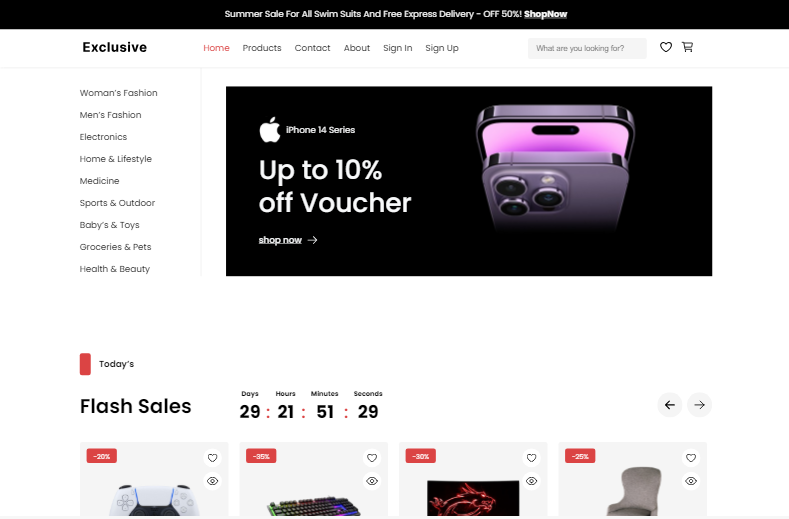

# Exclusive E-Commerce 🛒

## Live Demo  
  

---

## Introduction  
**Exclusive E-Commerce** is a modern and responsive web application designed for an exceptional online shopping experience. Built with React.js and Firebase, it offers advanced functionalities like user authentication, wishlist management, and a dynamic shopping cart system.  

---

## Features  
- **User Authentication:** Secure user login and registration powered by Firebase Authentication.  
- **Wishlist Management:** Add items to a wishlist for later purchase.  
- **Cart Functionality:** Seamless shopping cart experience with dynamic item updates.  
- **Responsive Design:** Optimized for desktops, tablets, and mobile devices.  

---

## Technologies  
- **React.js:** For building interactive UI components.  
- **Firebase:** For backend services including Authentication, Firestore Database, and Hosting.  
- **JavaScript (ES6):** For dynamic interactions and state management.  
- **Vite:** For fast development and optimized builds.  
- **CSS Modules:** For component-specific styling.  

---

## Technical Details  

### Firebase Integration  
- **Authentication:** Enables secure login and registration functionality.  
- **Hosting:** Deploy the app quickly with Firebase Hosting for global accessibility.  

### Responsive Layout  
- CSS Modules ensure a clean and scalable design.  
- Layout adapts dynamically for desktop, tablet, and mobile views.  

### Wishlist and Cart Management  
- Add and remove items dynamically.  
- Handle duplicate items and provide real-time feedback to users.  

### Alerts and Feedback  
- Custom feedback system provides instant user notifications for actions like adding items to the wishlist or cart.  

---

## Usage  

### Adding Items to Wishlist  
- Click the "Add to Wishlist" button on a product to save it for later.  
- Access your wishlist from the dedicated wishlist page.  

### Managing the Cart  
- Add items to the cart from the product listing or wishlist.  
- Move all wishlist items to the cart with a single click.  

---

## Deployment  
The app is hosted on Firebase Hosting. Follow these steps to deploy:  
1. Run `npm run build` to generate the production build.  
2. Initialize Firebase Hosting with `firebase init`.  
3. Deploy using `firebase deploy`.  

---

## Contributions  
Contributions are welcome! Feel free to fork this repository and submit pull requests.  

---
